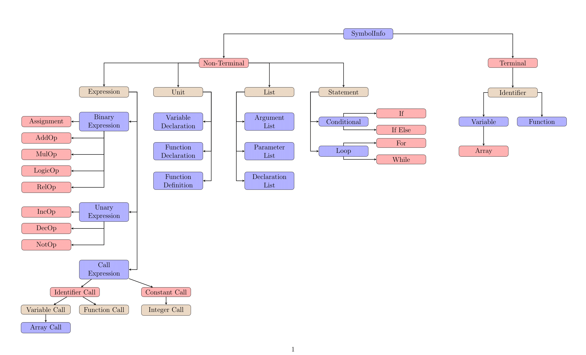
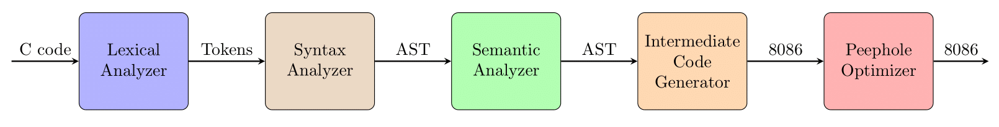

# **C Compiler (Bison+Flex)**

Preprocessor: `source.c` &rarr; `source.i`

**Compiler: `source.i` &rarr; `source.asm`**

Assembler: `source.asm` &rarr; `source.exe`

## Demo

Youtube: https://youtu.be/E7yGnD405UM?si=MQiZXQOHkM-sjeWF

https://user-images.githubusercontent.com/62663759/220677637-45c0c1f6-6a7d-403d-a189-6154b872da3e.mp4

## Offline01 - Symbol Table

- [Problem Specification](01_Symbol_Table\specs\CSE310_Assignment1_Specification.pdf)
- [Solution](01_Symbol_Table)

## Offline02 - Lexical Analysis

- [Problem Specification](02_Lexical_Analysis\specs\CSE310_July2022_Offline2_LexicalAnalysis_Specifications.pdf)
- [Solution](02_Lexical_Analysis)

## Offline03 - Syntax and Semantic Analysis

- [Problem Specification](03_Syntax_and_Semantic_Analysis\specs\CSE310_July_2022_YACC_Assignment_Spec-1.pdf)
- [Solution](03_Syntax_and_Semantic_Analysis)

## Offline04 - Intermediate Code Generation

- [Problem Specification](04_Intermediate_Code_Generation\specs\CSE_310_July_2023_ICG_Spec.docx.pdf)
- [Solution](04_Intermediate_Code_Generation)

<!-- 
<video width="900">
  <source src="demo.mp4" type="video/mp4">
</video>
 -->
 
## Compiler basics

- **Pattern:** Regex describing all the lexemes that can represent a particular token in source language
- **Lexeme:** Sequence of characters in the source program that matches the pattern for a token
- **Token:** Terminal symbols of the source language
<!-- ## Limitations
- Keywords
  - break
  - continue
  - do
  - switch
  - case
  - default
- Limited syntax error recovery -->

## AST Nodes

## Classes

- **SymbolInfo:** Holds the details of a symbol
- **ScopeTable:** Keeps track of the declared identifier in a scope
- **SymbolTable:** Keeps track of the scopes
- **ErrorHandler:** Prints out errors
- **Scanner:** Converts input C code to a list of tokens
- **Logger:** Prints out log output
- **Parser:** Creates Abstract Syntax Tree using given cfg and tokens from scanner
- **Tokenizer:** Creates token from a lexeme
- **LexicalAnalyzer:** Converts input C code to stream of tokens
- **SyntaxAnalyzer:** Checks if the grammar is syntactically correct
- **SemanticAnalyzer:** Checks if the grammar is semantically correct
- **AssemblyGenerator:** Converts the C code to Intel 8086 Assembly code
- **Optimizer:** Peephole optimization of the generated assembly code
- **CommentGenerator:** Documentation
- **ASTGenerator:** AST Printer
- **CodeGenerator:** AST to C converter
<!-- ## Variants of symbols
- Terminal
  - Identifier
    - Variable - Array
      - Function
- NonTerminal - Expression - ArrayCall - List - ParameterList - ArgumentList - DeclarationList - Block - if - if-else - for - while -->

## Workflow

## Tools

- flex 2.6.4
- bison 3.8.2
